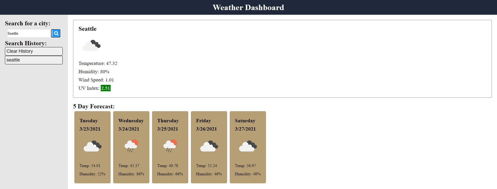

# weather-dashboard
This repository contains a web application made with html, css, javascript, focusing on the server side API [OpenWeather API](https://openweathermap.org/api).
This weather dashboard allows a user to search for the weather conditions of a city. The user will be presented with the city name, the date, an icon representation of weather conditions, the temperature, the humidity, the wind speed, and the UV index. There is also a 5-day forecast that displays the date, an icon representation of weather conditions, the temperature, and the humidity. The user's input is saved into localStorage and the user can click on any previous searches or clear history.

## Submission Links
Repository URL: [https://github.com/melissa-tan/weather-dashboard](https://github.com/melissa-tan/weather-dashboard)

Website URL: [https://melissa-tan.github.io/weather-dashboard/](https://melissa-tan.github.io/weather-dashboard/)

## Screenshot
The below image shows a screenshot of the weather dashboard.  

### Submission Requirements
- When a user searches for a city, the user is presented with current and future conditions for that city and that city is added to the search history
- The current weather includes the city name, the date, an icon representation of weather conditions, the temperature, the humidity, the wind speed, and the UV index that is color coded
- The future weather displays the date, an icon representation of weather conditions, the temperature, and the humidity
- If the user clicks on a city in the search history, the user is again presented with current and future conditions for that city

### Resources
- [OpenWeather API](https://openweathermap.org/api)
- [OpenWeather API Current Weather Data](https://openweathermap.org/current)
- [OpenWeather API One Call API](https://openweathermap.org/api/one-call-api)
